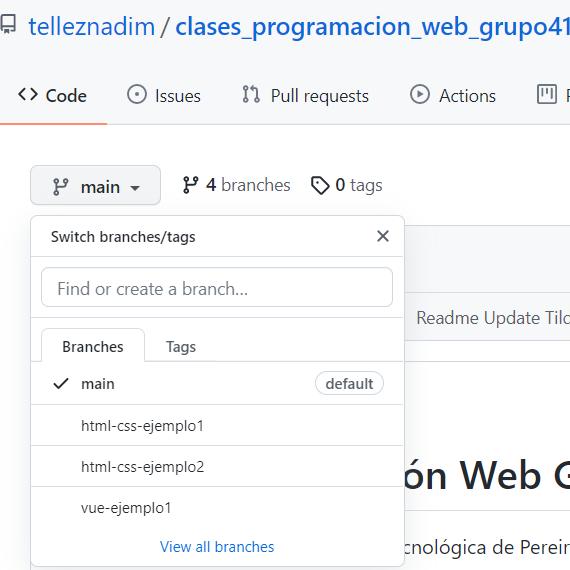
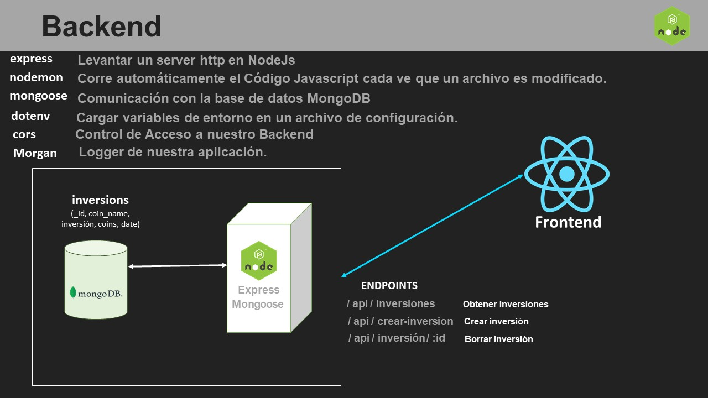
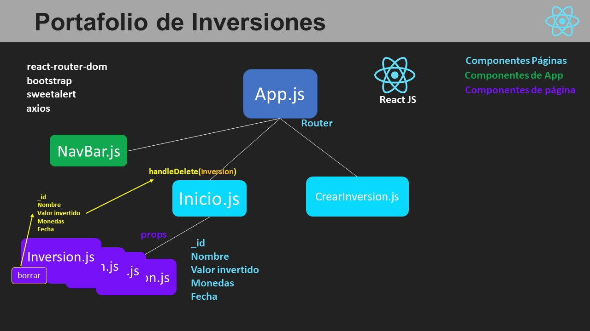
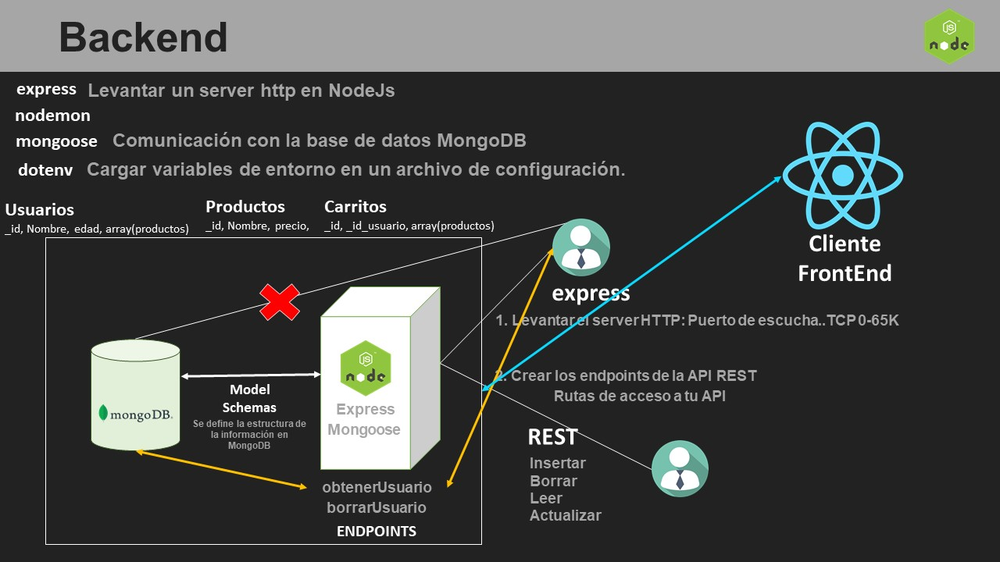
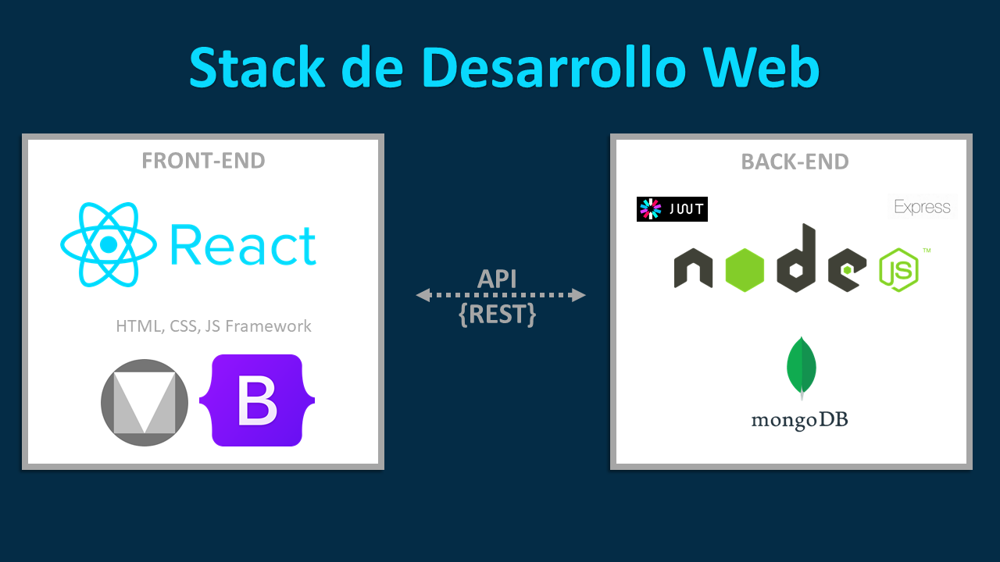

<!-- PROJECT SHIELDS -->
<!--
*** I'm using markdown "reference style" links for readability.
*** Reference links are enclosed in brackets [ ] instead of parentheses ( ).
*** See the bottom of this document for the declaration of the reference variables
*** for contributors-url, forks-url, etc. This is an optional, concise syntax you may use.
*** https://www.markdownguide.org/basic-syntax/#reference-style-links
-->

![github-lastcommit]
[![Contributors][contributors-shield]][contributors-url]
[![Stargazers][stars-shield]][stars-url]
[![LinkedIn][linkedin-shield]][linkedin-url]

<!-- PROJECT LOGO -->
<br />
<p align="center">
  <a href="https://github.com/telleznadim/ciclo4_desarrollo_aplicaciones_web_grupo03.git">
    
  </a>
  <h3 align="center">Proyectos y Ejemplos Desarrollados en Clase</h3>
</p>

<!-- TABLE OF CONTENTS -->
<details open="open">
  <summary><h2 style="display: inline-block">Tabla de Contenido</h2></summary>
  <ol>
    <li>
      <a href="#sobre-este-repo">Sobre Este Repo</a>
      <ul>
        <li><a href="#ejemplos-cargados">Ejemplos Cargados</a></li>
      </ul>
    </li>
    <li>
      <a href="#antes-de-iniciar">Antes de Iniciar</a>
      <ul>
        <li><a href="#herramientas">Herramientas</a></li>
      </ul>
    </li>
    <li><a href="#documentación-adicional">Documentación Adicional</a></li>
    <li><a href="#contacto">Contacto</a></li>
  </ol>
</details>

<!-- Sobre Este Repo -->

## Sobre Este Repo

[![Banner][banner-img]](Banner)

En este repo encontrarás todos los proyectos y ejemplos que desarrollaremos en clase. Te invito a que busques dentro de la lista de branches para que puedas ubicar con facilidad el contenido de la clase de tu interés. A continuación te dejo un pequeño gráfico donde te ubicarás mejor para encontrar cada branch:

<div align="center">
    
</div>

### Ejemplos cargados:

#### Ejemplos Ciclo 3 (Vue, Vuetify, NodeJs, MongoDB)

- [HTML CSS Ejemplo1](https://github.com/telleznadim/clases_programacion_web_grupo41/tree/html-css-ejemplo1)
- [HTML CSS Ejemplo2 - Desarrollo de Página Web Club de Ark](https://github.com/telleznadim/clases_programacion_web_grupo41/tree/html-css-ejemplo2)
- [VUE.js Ejemplo1](https://github.com/telleznadim/clases_programacion_web_grupo41/tree/vue-ejemplo1)
- [VUE.js Ejemplo2](https://github.com/telleznadim/clases_programacion_web_grupo41/tree/vue-ejemplo2)
- [VUE.js Ejemplo3 Lista de Pokemons](https://github.com/telleznadim/clases_programacion_web_grupo41/tree/vue-eje3-lista-pokemons)
- [VUE.js Ejemplo1 Captura la Pokéball](https://github.com/telleznadim/clases_programacion_web_grupo41/tree/vue-instalado-captura-la-pokeball)
- [VUE.js y Vuetify Ejemplo2 Pokemon Trainers Wiki](https://github.com/telleznadim/clases_programacion_web_grupo41/tree/vue-instalado-pokemon-trainers-wiki)
- [Pokemon Trainers Wiki - Frontend](https://github.com/telleznadim/clases_programacion_web_grupo41/tree/pokemon-trainers-wiki-frontend)
- [Pokemon Trainers Wiki - Backend](https://github.com/telleznadim/clases_programacion_web_grupo41/tree/pokemon-trainers-wiki-backend)

#### Ejemplos Ciclo 4 (React, Bootstrap, NodeJs, MongoDB)

- [Portafolio de Inversiones en Crypto monedas](https://github.com/telleznadim/ciclo4_desarrollo_aplicaciones_web_grupo03/tree/portafolio_inversiones)

Te comparto también una documentación sencilla del FrontEnd y el Backend de esta aplicaciónÑ

<div align="center">
    
</div>

<div align="center">
    
</div>

<!-- GETTING STARTED -->

## Antes de Iniciar

Antes de que inicies aségurate de leer lo siguiente, con el fin de que tengas seguridad sobre qué herramientas necesitarás para poder usar los ejercicios de este Repo.

### Herramientas

- Visual Studio Code (Gratis). [Descárgalo aquí](https://code.visualstudio.com/)

  Te recomiendo las siguientes extensiones de Visual Studio Code:

  - HTML CSS Support
  - HTML Snippets
  - Javascript (ES6) code snippets
  - Prettier - Code Formatter
  - Indent-rainbow
  - Material Icon Theme
  - Simple React Snippets
  - GitHub Pull Requests and Issues

- Google Chrome (Consola de Desarrollador y React Developer Tool).
- Git. [Descárgalo aquí](https://git-scm.com/downloads)
- NodeJs (Current). [Descárgalo aquí](https://nodejs.org/en/)
- React.js. Para poder crear una primera aplicación en React deberás seguir el siguiente procedimiento:
  1. Ejecutar lo siguiente:
     ```sh
     npx create-react-app <nombre-de-app>
     ```
  2. Ingresas a la carpeta de la nueva creacion:
     ```sh
     cd <nombre-de-app>
     ```
  3. Ejecutas el servidor de React:
     ```sh
     npm start
     ```
- MongoDB Community Edition. [Descárgalo aquí](https://www.mongodb.com/try/download/community)
- Librerías para NodeJs: Express, Nodemon, Mongoose, Morgan, dotenv, cors).
- Heroku Cli. [Descárgalo aquí](https://devcenter.heroku.com/articles/heroku-cli)
- Explicación sencilla de qué es un Backend:

<div align="center">
    
</div>

## Links de nuestras clases

# Ciclo 3

- [Introducción Inicial (Aclaración de dudas generalizadas - Introducción a la Programación Web) - 13/09/21](https://www.youtube.com/watch?v=guNoEWwDDPk&t)
- [HTML y CSS (Clase práctica básica) - 14/09/21](https://www.youtube.com/watch?v=jSwgYyZRDIU&t)
- [Aplicando HTML y CSS en una primera página web (Club de Ark). Intruducción a Vue.js - 16/09/21](https://www.youtube.com/watch?v=llaXyYzk6vM&t)
- [Aplicaciones básicas de Vue.js y su utilidad. (Lista de Pokemons Parte 1) - 20/09/21](https://www.youtube.com/watch?v=ohZIHW24QEM)
- [Aplicaciones básicas de Vue.js y su utilidad. (Lista de Pokemons Parte 2) - 21/09/21](https://www.youtube.com/watch?v=1oVmM_2cnt4)
- [Juego en Vue, Temporizador - Atrapa la Pokeball (Parte 1) - 23/09/21](https://www.youtube.com/watch?v=jesUxaRCa2o)
- [Juego en Vue, Temporizador - Atrapa la Pokeball (Parte 2) - Vuetify Página Pokémon Trainers Wiki - 27/09/21](https://www.youtube.com/watch?v=zsdoaeaC5YY)
- [Vue y Vuetify Página Pokémon Trainers Wiki (Parte 2) - 30/09/21](https://www.youtube.com/watch?v=fnZsrVmN3n4)
- [Vue y Vuetify Página Pokémon Trainers Wiki (Parte 3) - 04/10/21](https://www.youtube.com/watch?v=Q6MQzLN2qJU)
- [CRUD y funcionalidades básicas de MongoDB - 05/10/21](https://www.youtube.com/watch?v=V6bP1mX9_sY)
- [Conceptos básicos NodeJs - 07/10/21](https://www.youtube.com/watch?v=ktjNolx1FMs)
- [NodeJs (Express, Mongoose, Morgan y Nodemon). Breve tutorial de Heroku - 11/10/21](https://www.youtube.com/watch?v=FsJ9vhs9Vug)

# Ciclo 4

<!-- DOCUMENTACIÓN -->

## Documentación Adicional

También te recomiendo la documentación oficial y no oficial de las temáticas tratadas en clase:

- [HTML](https://www.w3schools.com/html/)
- [CSS](https://www.w3schools.com/css/)
- [JavaScript](https://developer.mozilla.org/en-US/docs/Web/JavaScript)
- [Vue.js](https://vuejs.org/v2/guide/)
- [Vuetify](https://vuetifyjs.com/en/introduction/why-vuetify/#feature-guides)
- [Express](https://expressjs.com/)
- [Mongoose](https://mongoosejs.com/docs/guide.html)
- [Heroku](https://devcenter.heroku.com/articles/git)
- [HerokuVueApp](https://cli.vuejs.org/guide/deployment.html#heroku)
- [Bootstrap](https://getbootstrap.com/docs/5.1/getting-started/introduction/)
- [ÍconosBootstrap](https://icons.getbootstrap.com/)
- [ReactJs](https://reactjs.org/)

Y a continuación te comparto el Stack tecnológico que trabajaremos para el desarrollo de todas las clases del ciclo 4:

<div align="center">
    
</div>

<!-- CONTACTO -->

## Contacto

Nadim M. Téllez B. - telleznadim@gmail.com

<!-- MARKDOWN LINKS & IMAGES -->

[contributors-shield]: https://img.shields.io/github/contributors/telleznadim/clases_programacion_web_grupo41?style=for-the-badge
[contributors-url]: https://github.com/telleznadim/clases_programacion_web_grupo41/graphs/contributors
[stars-shield]: https://img.shields.io/github/stars/telleznadim/clases_programacion_web_grupo41?style=for-the-badge
[stars-url]: https://img.shields.io/github/stars/telleznadim/clases_programacion_web_grupo41
[linkedin-shield]: https://img.shields.io/badge/-LinkedIn-black.svg?style=for-the-badge&logo=linkedin&colorB=555
[linkedin-url]: https://www.linkedin.com/in/nadim-tellez-466451a1/
[github-lastcommit]: https://img.shields.io/github/last-commit/telleznadim/clases_programacion_web_grupo41?style=for-the-badge
[banner-img]: img/react.jpg
